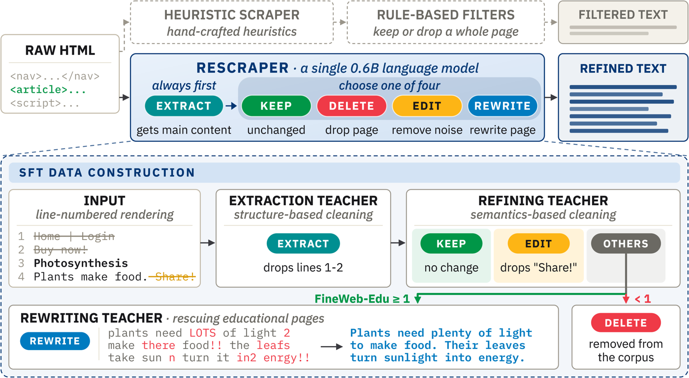

# ReScraper: Unified Scraping and Cleaning of Web Data for Effective LLM Pretraining

Code release for the ReScraper paper.

- Paper: [arXiv:2609.34287](https://arxiv.org/abs/2609.34287)
- Model: [`cx-cmu/ReScraper`](https://huggingface.co/cx-cmu/ReScraper)
- Data: [`cx-cmu/ReScraper-Data`](https://huggingface.co/datasets/cx-cmu/ReScraper-Data)

ReScraper replaces the heuristic HTML-to-text stack of pretraining pipelines (a rule-based scraper followed by
rule-based cleaning filters) with one small language model (Qwen3-0.6B). The model reads the visible text of a
raw web page, rendered one block per line with line ids `<lid:n>`, and generates a short program:

```
<keep>|<edit>|<delete>|<rewrite>      the operation chosen for the page
<extract>                             always first: remove boilerplate lines
rm A-B / rm A                         (lines that are not main content)
<same operation again>
payload                               <edit>: rm A-B / sub N: "s" (delete lines / strings); <rewrite>: new text
```

A deterministic executor (`lib/rescraper_ops.py`) applies the program to the rendered lines, so kept text is copied, not
regenerated. The supervision is built from three teachers run in sequence on the same rendering: Dripper
(main-content extraction -> `<extract>`), Qwen3.8-27B under a strict-subset refinement prompt (-> `<keep>`,
`<edit>`, `<delete>`), and the RePro 1B rephraser for teacher-deleted pages whose FineWeb-Edu score is at least 1.0
(-> `<rewrite>`). The student is fine-tuned in two stages (all operations; then a rewrite-heavy mixture), applied to
the raw HTML of the whole DCLM source pool, and the output is deduplicated and tokenized for DCLM pretraining at the
400M, 1B and 3B scales.

<p align="center">
  
</p>

## Contents

- [Pipeline](#pipeline)
- [Setup](#setup)
- [Reproducing the released model and corpus](#reproducing-the-released-model-and-corpus)
- [Citation](#citation)
- [License](#license)

## Pipeline

```
DCLM pool sample (raw HTML, ~10.3K shards, 18.0M pages)
 │
 ├─ data_construction/dripper/        Dripper over the pool (teacher 1; also the base of the scraper baselines)
 ├─ data_construction/seed_pages/     ~1.6M SFT seed pages (held-out shards excluded by stem)
 ├─ data_construction/teacher_refine/ Qwen3.8-27B refinement labels (teacher 2)
 ├─ data_construction/base_set/       render raw HTML -> <lid:n> input; serialized target; no-rewrite base set (1.38M)
 ├─ data_construction/rescue/         FineWeb-Edu of deleted pages; RePro 1B rewrites (teacher 3)
 ├─ data_construction/sft_sets/       Stage-1 set (1.38M) and Stage-2 set (131K, 30% <rewrite>)
 ├─ training/                         Stage 1 (Qwen3-0.6B, 3 epochs) -> Stage 2 (from the epoch-2 checkpoint, 3 epochs)
 ├─ inference/                        Stage-2 model over the pool (T=1.0, 3,072 new tokens) -> executor -> post-filter
 ├─ corpus/                           BFF dedup (13-gram, 0.8) -> GPT-NeoX-20B tokens (7.44B unique tokens)
 └─ pretraining/                      DCLM 411m_1x / 1b_1x_fast pretraining, 22-task Core evaluation (eval_sheet.py)

baselines/     rule stacks (C4 / RefinedWeb / FineWeb rules), scrapers (resiliparse, trafilatura, jusText, Dripper),
               ProX-C, UltraX
ablations/     operation ablation (Table 3) and the two-stage "Dripper <extract>" refiner
evaluation/    5,000-page held-out set, page-aligned outputs of every pipeline, teacher fidelity, extraction F1,
               gpt-oss-120b judges, DataMan / FineWeb-Edu scoring, n-gram diversity
analysis/      scripts behind every figure and table
prompts/       every prompt, verbatim
lib/           shared modules (renderer, line operations, executor, rephraser helpers)
```

## Setup

1. Environments (`requirements/README.md`):
   - refiner: Python 3.12, torch 2.9.0+cu128, transformers 4.57.6, vLLM 0.11.1, DeepSpeed, flash-attn 2.8.3, and
     `dripper==1.0.0` (MinerU-HTML, which provides the page renderer) -> `requirements/refiner.txt`;
   - teacher: an environment that can serve Qwen3.8-27B (vLLM 0.28.0, transformers 5.16.1) -> `requirements/teacher.txt`;
   - DCLM: upstream DCLM at commit `c59dd5878c8bd1965b4894e20d8a091e8fdeac7a` plus our patch -> `pretraining/README.md`,
     `requirements/dclm.txt`;
   - tools of the baselines and evaluation (datatrove 0.2.0, trafilatura 2.0.0, jusText 3.0.2, resiliparse 0.16.0,
     gpt-oss-120b via vLLM) -> READMEs of `baselines/` and `evaluation/`.
2. `cp configs/paths.env.example configs/paths.env`, edit, `source configs/paths.env`. All scripts read locations
   from these variables (`RESCRAPER_ROOT`, `WORK_DIR`, `DCLM_DIR`, model identifiers, python interpreters).
3. SLURM scripts are examples written for 8-GPU (H200) nodes. `#SBATCH --partition=gpu|cpu` are placeholders:
   override with `-p` or `SBATCH_PARTITION`; chains use `GPU_PARTITION` / `CPU_PARTITION`.

The source pool is a 10% shard sample of the DCLM `dclm-pool-400m-1x` pool (raw HTML, English pages); every pipeline
starts from the same pages. Held-out shards are listed in `$HELDOUT_SHARDS`.

## Reproducing the released model and corpus

All commands assume `source configs/paths.env`. Each directory's README lists inputs, outputs, compute and the
exact settings of our runs.

### Step 1: Sample the seed pages

Draw the pages that supervision is built from, out of the raw-HTML source pool:

```bash
python data_construction/seed_pages/sample_seed_pages.py 1600000
```

### Step 2: Extract the main content (teacher 1)

Run Dripper over the pool. Its main-content decision becomes the `<extract>` line removals:

```bash
sbatch --array=0-161 data_construction/dripper/run_dripper_pool.sbatch
sbatch --array=0-15  data_construction/dripper/run_convert_text.sbatch
```

### Step 3: Label the operation (teacher 2)

Qwen3.8-27B, under a strict-subset refinement prompt, chooses `<keep>`, `<edit>` or `<delete>` and produces the
edits; the base set then joins the two teachers on the same rendering:

```bash
sbatch data_construction/teacher_refine/label_qwen27b.sbatch
python data_construction/base_set/select_pages.py $SFT_DIR/base_set/half1
sbatch data_construction/base_set/join_render.sbatch $SFT_DIR/base_set/half1
sbatch data_construction/base_set/build_base_set.sbatch $SFT_DIR/base_set/base_set_norw.jsonl \
       $SFT_DIR/base_set/half1 $SFT_DIR/base_set/half2
```

### Step 4: Rescue deleted pages (teacher 3)

Score the teacher-deleted pages with FineWeb-Edu; those at 1.0 or above are rephrased by RePro 1B and relabelled
`<rewrite>`:

```bash
sbatch --array=0-13 --export=ALL,WORLD=112 data_construction/rescue/rescue_build.sbatch
sbatch data_construction/rescue/score_edu_pool.sbatch
sbatch --array=0-3 --export=ALL,WORLD=28 data_construction/rescue/rewrite_pool.sbatch
```

### Step 5: Train the refiner

Two supervised stages: first all operations, then a rewrite-heavy mixture so the model learns the operation it
would otherwise almost never see:

```bash
sbatch training/stage1_chain.sbatch
sbatch training/stage2_chain.sbatch          # -> $STAGE2_CKPT
```

### Step 6: Refine the whole pool

Apply the trained model to the raw HTML of every source page, then post-filter, deduplicate and tokenize:

```bash
sbatch --array=0-27 --export=ALL,WORLD=224,INFER_MODEL_PATH=$STAGE2_CKPT inference/infer_pool.sbatch
sbatch --dependency=afterany:<array id> corpus/finish_chain.sbatch rescraper $STAGE2_CKPT \
       $RESCRAPER_ROOT/prompts/student_system_stage2.txt
```

### Step 7: Pretrain and evaluate

Train on the resulting corpus and score it on DCLM Core:

```bash
sbatch -J pt1b_rescraper pretraining/pretrain_1b.sh rescraper_norule_noft 29717
sbatch --dependency=afterok:<pt id> pretraining/eval_packed.sbatch rescraper_norule_noft 1b
```

## Citation

```bibtex
@article{yu2026rescraper,
  title   = {ReScraper: Unified Scraping and Cleaning of Web Data for Effective LLM Pretraining},
  author  = {Yu, Zichun and Yan, Jiarui and Sanghvi, Shlok and Atri, Nihar and Xiong, Chenyan},
  journal = {arXiv preprint arXiv:2609.34287},
  year    = {2026}
}
```

## License

Apache-2.0 (`LICENSE`). Third-party models and tools keep their own licenses.
